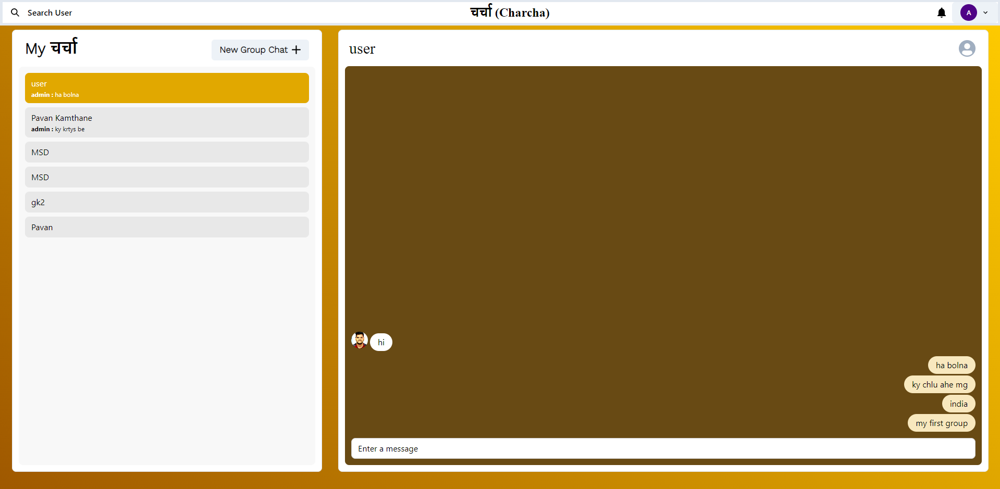

# 📢 चर्चा (Charcha)

A real-time chat application built using the **MERN** stack. The app allows users to communicate through a clean and intuitive interface with support for real-time messaging.



---

## 🚀 Tech Stack

- **Frontend**: React.js (with Chakra UI for components and styling)
- **Backend**: Node.js with Express
- **Database**: MongoDB with Mongoose
- **Authentication**: JWT (JSON Web Tokens)
- **Styling**: Chakra UI
- **Animation**: Framer Motion
- **State Management**: React Context API
- **Real-time Communication**: Socket.io (optional, depending on your plan)

---

## 📋 Features

- User authentication (Login/Signup)
- Real-time messaging
- Secure communication with JWT-based authentication
- Responsive and modern UI built with Chakra UI
- Smooth animations with Framer Motion
- Scrollable chat feed for a seamless experience

---

## 🛠️ Project Setup

### 1. Clone the repository
```bash
git clone https://github.com/your-username/charcha.git
cd charcha
```

### 2. Backend Setup
- Navigate to the backend folder:
```bash
cd backend
```
- Install dependencies:
```bash
npm install
```
- Create a `.env` file in the backend folder and add the following variables:
```
MONGO_URI=<Your MongoDB Connection String>
JWT_SECRET=<Your JWT Secret>
```
- Start the backend server:
```bash
npm start
```

### 3. Frontend Setup
- Navigate to the frontend folder:
```bash
cd ../frontend
```
- Install frontend dependencies:
```bash
npm install
```
- Start the frontend development server:
```bash
npm start
```

---

## 🖼️ Current Project Status


The project is currently in development with basic routing and authentication features in place.

---

## 🔮 Planned Features

- [ ] Chatrooms for multiple users
- [ ] Real-time notifications
- [ ] File and media sharing
- [ ] Video calls using WebRTC
- [ ] Dark mode toggle

---

## 🧑‍💻 Contributing

Contributions are always welcome! To contribute:
1. Fork the repository.
2. Create a new branch (`git checkout -b feature-branch`).
3. Make your changes.
4. Commit and push to your branch (`git push origin feature-branch`).
5. Create a Pull Request.

---

## 📄 License

This project is licensed under the MIT License.

---

## 📫 Contact

For any inquiries, please reach out to:
**Pavan Kamthane** - [Pavan.Kamthane@studentambassadors.com](mailto:Pavan.Kamthane@studentambassadors.com)

Feel free to open an issue if you find any bugs or have suggestions!
```

This `README.md` gives potential users and contributors a clear idea of how to set up and contribute to your project. You can update the image paths and repository links as needed.